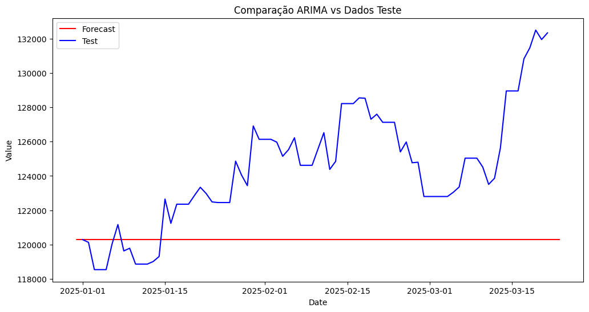
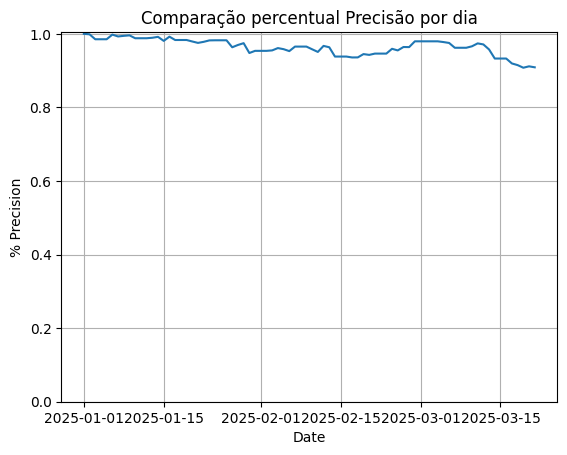

# Predição de pontos da bolsa de valores Brasileira (IBOV)

Este projeto tem como objetivo lidar com dados para prever os valores do mercado de ações, especificamente o índice "ibov". O projeto utiliza uma arquitetura de dados baseada nas etapas do medallion (bronze, prata e ouro) para processar e transformar os dados.

## Visão Geral


## Estrutura do Projeto

O projeto está organizado nos seguintes diretórios:

```plaintext
challenges/
└── 2_ibov/
    ├── code/
    │   ├── bronze/
    │   ├── silver/
    │   └── gold/
    ├── data/
    │   ├── bronze/
    │   │   └── source_investing/
    │   │       ├── category=commodities/
    │   │       │   └── item=ferro/
    │   │       │       └── Dados Históricos - Minério de ferro refinado 62_ Fe CFR Futuros.csv
    │   │       ├── category=crypto/
    │   │       │   └── item=bitcoin/
    │   │       │       └── Dados Históricos - Bitcoin.csv
    │   │       └── category=currencies/
    │   │           └── item=usd_brl/
    │   │               └── Dados Históricos - Dollar.csv
    │   ├── silver/
    │   │   └── silver.parquet
    │   └── gold/
    │       └── gold.parquet
    └── plots/
        ├── plot1.png
        └── plot2.png
```

## Seleção Dos Índices a Serem Utilizados

Nesta seção, são apresentados os índices selecionados para análise, divididos em quatro categorias principais: Commodities, Criptomoedas, Moedas e Índices. Cada um deles é descrito com sua relevância e impacto no mercado brasileiro, considerando todos temos uma visão abrangente e diversificada do mercado, permitindo uma análise detalhada para a predição dos pontos da bolsa de valores Brasileira (IBOV).

### Commodities

- **Cobre**: Indicador da saúde econômica global, impactando empresas de mineração e setores industriais no Brasil.
- **Ferro**: Essencial para a produção de aço, afetando diretamente empresas como a Vale.
- **Ouro**: Ativo de refúgio em tempos de incerteza econômica, influenciando empresas de mineração de ouro.
- **Petróleo**: Crucial para a economia global, com grande impacto na Petrobras.
- **Prata**: Usada na indústria e como investimento, afetando empresas de mineração de prata.

### Criptomoedas

- **Bitcoin**: Principal criptomoeda, usada como reserva de valor e investimento.
- **Ethereum**: Conhecida por suas aplicações em contratos inteligentes, afetando o sentimento dos investidores.

### Moedas

- **EUR/BRL**: Taxa de câmbio entre o Euro e o Real Brasileiro, afetando empresas que exportam para a Europa ou importam produtos europeus.
- **USD/BRL**: Taxa de câmbio entre o Dólar Americano e o Real Brasileiro, impactando fortemente a economia brasileira.

### Índices

- **BBSA3**: Ações do Banco do Brasil, refletindo o desempenho do setor bancário.
- **CPLE6**: Ações da Copel, indicador do setor de energia elétrica.
- **CRFB3**: Ações do Carrefour Brasil, refletindo o setor de varejo.
- **ELET3**: Ações da Eletrobras, importante para o setor de energia elétrica.
- **FLRY3**: Ações da Fleury, indicador do setor de saúde.
- **FTXIN9**: Índice de fundos imobiliários, refletindo o mercado imobiliário.
- **Ibov**: Índice Bovespa, principal índice da bolsa brasileira.
- **Ibov Futuro**: Contratos futuros do Ibovespa, indicador de expectativas futuras do mercado.
- **IBRX100**: Índice das 100 ações mais negociadas na B3.
- **IBRX50**: Índice das 50 ações mais negociadas na B3.
- **ITUB4**: Ações do Itaú Unibanco, refletindo o desempenho do setor bancário.
- **MGLU3**: Ações da Magazine Luiza, indicador do setor de varejo.
- **NDX**: Nasdaq 100, índice das 100 maiores empresas não financeiras listadas na Nasdaq.
- **PETR3**: Ações da Petrobras, crucial para o setor de energia no Brasil.
- **RENT3**: Ações da Localiza, indicador do setor de serviços.
- **SLCE3**: Ações da SLC Agrícola, refletindo o setor agrícola.
- **SPX**: S&P 500, índice das 500 maiores empresas dos EUA.
- **STOXX50E**: Índice das 50 maiores empresas da zona do euro.
- **US30**: Dow Jones Industrial Average, índice das 30 maiores empresas dos EUA.
- **US500**: S&P 500, similar ao SPX.
- **VALE3**: Ações da Vale, importante para o setor de mineração.
- **VIX**: Índice de volatilidade, medindo a expectativa de volatilidade do mercado.

### Correlação dos indicies selecionados com IBOV


### Correlação Entre os indicies selecionados


## Arquitetura de Dados

### Camada Bronze - Fluxo de Dados

A camada bronze envolve a ingestão inicial e a limpeza básica dos dados brutos. Os dados são lidos a partir de arquivos CSV e transformações básicas são aplicadas para limpar e normalizar os dados.

- **Arquivo:** bronze/process_investing_data.ipynb
- **Etapas:**
  - Ler dados brutos de arquivos CSV.
  - Renomear colunas e converter tipos de dados.
  - Remover duplicatas e lidar com valores ausentes.
  - Salvar os dados limpos na camada prata.

### Camada Prata - Fluxo de Dados

A camada prata envolve o processamento e enriquecimento adicional dos dados. Isso inclui lidar com dados ausentes, normalizar valores e criar um DataFrame consolidado com todos os índices.

- **Arquivo:** silver/process_investing_data.ipynb
- **Etapas:**
  - Ler dados da camada bronze.
  - Criar um dicionário de todos os índices e seus respectivos dados.
  - Gerar uma lista de todas as datas disponíveis.
  - Consolidar dados em um único DataFrame com todos os índices.
  - Lidar com dados ausentes preenchendo lacunas com o último valor disponível.
  - Salvar os dados processados na camada ouro.

### Camada Ouro - Fluxo de Dados

A camada ouro envolve o processamento final e a preparação dos dados para análise e modelagem. Isso inclui calcular correlações, ajustar modelos de séries temporais e gerar previsões.

- **Arquivo:** gold/process_investing_data.ipynb
- **Etapas:**
  - Ler dados da camada prata.
  - Calcular matrizes de correlação.
  - Ajustar modelos ARIMA aos dados.
  - Gerar previsões e compará-las com os valores reais.
  - Plotar os resultados e calcular métricas de precisão.

## Configuração

Para configurar o ambiente de desenvolvimento e instalar as bibliotecas necessárias, siga as instruções nos notebooks. O projeto utiliza Python, PySpark, Pandas, NumPy, Matplotlib, Seaborn e Statsmodels.

## Execução

Para executar os notebooks, siga a ordem das camadas:

1. Execute o notebook da camada bronze para ingerir e limpar os dados brutos.
2. Execute o notebook da camada prata para processar e enriquecer os dados.
3. Execute o notebook da camada ouro para analisar e modelar os dados.

Seguindo esses passos, você será capaz de prever os valores do índice do mercado de ações "ibov" usando os dados processados.

## Fluxo de Dados

### Camada Bronze

1. **Ingestão de Dados**:
   - Ler dados brutos de arquivos CSV localizados no [diretório de dados bronze](challenges/2_ibov/data/bronze/), Utilizando PySpark para particionar os dados durante a leitura (O particionamento permite que o processamento dos dados seja distribuído entre múltiplos nós do cluster, aumentando a eficiência e a velocidade da ingestão e transformação dos dados)
   - Exemplos de caminhos completos com partições:
     - `data/bronze/category=commodities/item=ferro/Dados Históricos - Minério de ferro refinado 62_ Fe CFR Futuros.csv`
     - `data/bronze/category=crypto/item=bitcoin/Dados Históricos - Bitcoin.csv`
     - `data/bronze/category=currencies/item=usd_brl/Dados Históricos - Dollar.csv`

2. **Limpeza de Dados**:
   - Renomear colunas e converter tipos de dados.
   - Salvar os dados limpos na camada prata.

3. **Processamento**:
   - bronze/process_investing_data.ipynb

4. **Output**
   - data/silver/silver.parquet

### Camada Prata

1. **Processamento de Dados**:
   - Ler dados da camada bronze.
   - Criar um dicionário de todos os índices e seus respectivos dados.
   - Gerar uma lista de todas as datas disponíveis.
   - Consolidar dados em um único DataFrame com todos os índices.

2. **Lidar com Dados Ausentes**:
   - Preencher lacunas com o último valor disponível.

3. **Salvar Dados Processados**:
   - Salvar os dados processados na camada ouro.

4. **Processamento**:
   - silver/process_investing_data.ipynb

5. **Output**
   - data/silver/gold.parquet

### Camada Ouro

1. **Análise de Dados**:
   - Ler dados da camada prata.
   - Calcular matrizes de correlação.

2. **Modelagem**:
   - Ajustar modelos ARIMA aos dados.
   - Gerar previsões e compará-las com os valores reais.

3. **Visualização**:
   - Plotar os resultados e calcular métricas de precisão.

4. **Processamento**:
   - gold/process_investing_data.ipynb

5. **Output**
   - Modelo de predição

## Previsão Dados

### Resultados ARIMA

#### Definição ARIMA

O modelo ARIMA (AutoRegressive Integrated Moving Average) é uma técnica de análise de séries temporais que combina três componentes principais: autoregressão (AR), diferenciação (I) e média móvel (MA). Ele é utilizado para entender e prever valores futuros com base em dados históricos, ajustando-se a padrões e tendências presentes na série temporal.

- **AR (AutoRegressive)**: Utiliza a relação entre uma observação e várias observações anteriores.
- **I (Integrated)**: Utiliza a diferenciação das observações para tornar a série temporal estacionária.
- **MA (Moving Average)**: Modela o erro da previsão como uma combinação linear de erros passados.

O modelo ARIMA é representado como ARIMA(p, d, q), onde:

- **p**: Ordem da parte autoregressiva.
- **d**: Número de diferenciações necessárias para tornar a série estacionária.
- **q**: Ordem da média móvel.

#### Comparação Previsão X Teste



#### Percentual Precisão Diário



### Resultados NAIVE

#### Definição NAIVE

O modelo Naive é uma técnica simples para previsão de séries temporais. Ele parte da ideia de que o melhor palpite para o próximo valor é o valor mais recente da série.

Na prática, se o valor da série no tempo t é Yₜ, então a previsão para o próximo ponto (t+1) será:
- Yₜ₊₁ = Yₜ

Apesar de sua simplicidade, o modelo Naive é bastante usado como ponto de partida (ou benchmark) para comparar com modelos mais sofisticados.

##### Comparação Previsão X Teste
Ao comparar as previsões do modelo Naive com os dados reais de teste, conseguimos avaliar se modelos mais avançados — como ARIMA ou algoritmos de machine learning — realmente oferecem melhorias relevantes em relação a essa previsão simples.

#### Plot 1
#### Plot 2
#### Plot 3

### Resultados SEAZONAL NAIVE

#### Definição SEAZONAL NAIVE

O modelo Seasonal Naive é uma variação do modelo Naive, indicada para séries temporais com padrão sazonal. Nesse caso, a previsão para um determinado período considera o valor observado no mesmo período da estação anterior.

Em termos práticos, se a série tem uma sazonalidade com período s, o modelo assume que:
- Yₜ = Yₜ₋ₛ

Ou seja, a previsão para o tempo t será igual ao que foi observado s períodos atrás.

O modelo é muito utilizado em setores com padrão sazonal, como varejo, turismo, produção agrícola ou séries financeiras com efeitos de calendário (ex: comportamento semanal da bolsa de valores).

##### Comparação Previsão X Teste
Ao avaliar o desempenho do modelo Seasonal Naive nos dados de teste, conseguimos entender se apenas considerar a sazonalidade já é suficiente ou se vale a pena investir em modelos mais robustos, como o SARIMA ou técnicas baseadas em machine learning.

#### Plot 1
#### Plot 2
#### Plot 3

## Referencias

### Referencias Gerais

- [Explicação Índice Ibov](https://www.b3.com.br/pt_br/market-data-e-indices/indices/indices-amplos/ibovespa.htm)
- [Composição Índice Ibov](https://www.b3.com.br/pt_br/market-data-e-indices/indices/indices-amplos/indice-ibovespa-ibovespa-composicao-da-carteira.htm)
- [Cotação Índice IBOV](https://br.investing.com/indices/bovespa)
- [Investing - Principais Indices](https://br.investing.com/indices/major-indices)
- [Investing - Principais BR](https://br.investing.com/indices/brazil-indices)

### Artigos

- [Explicação ARIMA](https://doi.org/10.1002/for.3980020104)
- [Utilização ARIMA para previsão IBOV](http://dx.doi.org/10.4236/am.2014.521315)
- [Exploração da volatilidade do IBOV](http://hdl.handle.net/10174/30645)
- [Impacto de elementos de macro-economia no IBOV](https://doi.org/10.1080/19186444.2013.11658374)
- [Comparação de modelos de Machine learning para Previsão de Series Temporais](http://dx.doi.org/10.1080/07474938.2010.481556)
- [Comparação de modelos de Machine learning para Previsão de Series Temporais - PDF](https://www.researchgate.net/publication/227612766_An_Empirical_Comparison_of_Machine_Learning_Models_for_Time_Series_Forecasting)
- [Redes Neurais para problemas de Series Temporais](http://dx.doi.org/10.1007/978-0-306-47630-3_12) (Capitulo do livro: "Principles of Forecasting")
- [Redes Neurais para problemas de Series Temporais - PDF](https://www.researchgate.net/publication/290106965_Neural_Networks_for_Time-Series_Forecasting)

## Autores

### Lucas Nunes De Assis

[LinkedIn](https://www.linkedin.com/in/lucasnunesdeassis/)

### Lucas da Cruz Ramos

[LinkedIn](https://www.linkedin.com/in/lucas-da-cruz-ramos/)

### Lucas Fabri De Oliveira

[LinkedIn](https://www.linkedin.com/in/lucas-fabri-de-oliveira-044405b6/)

### Jorge Luis Rodrigues

[LinkedIn](https://www.linkedin.com/in/jorge-luis-rodrigues-3a78807a/)

### Rafael Cuer

[LinkedIn](https://www.linkedin.com/in/rafaelcuer/)
