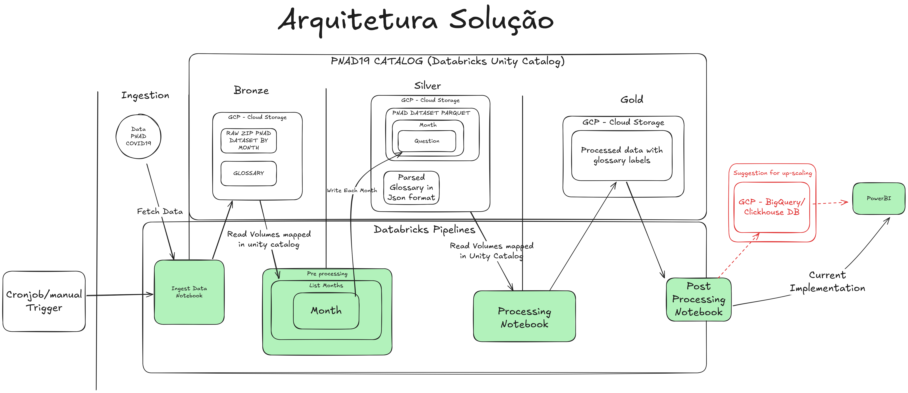

# PNAD COVID 19

Entrega realizada utilizando Power Point & [POWER BI](https://app.powerbi.com/view?r=eyJrIjoiMDJhMjYwY2MtYzdhOC00ZWRjLThjNjQtZjVlODY0M2FkZmU4IiwidCI6ImQ1YjA5ZjNhLThkMTUtNDg2Yi05OTJiLWMzZThlMDFiODE1YSIsImMiOjl9) (Este README é um extra)

------

Este projeto tem como objetivo realizar o processamento de dados da PNAD COVID-19 utilizando a arquitetura de dados Medallion (Bronze, Silver e Gold). A partir dos dados brutos, o pipeline realiza transformações e análises para gerar insights sobre os impactos da COVID-19 na população brasileira.

## Estrutura do Projeto

O projeto está dividido em três etapas principais:

## Notebooks

* Ingest Notebook: [ingest](./code/ingest/ingest.ipynb)
* Bronze Notebook: [bronze](./code/bronze/pre_processing.ipynb)
* Silver Notebook: [silver](./code/silver/processing.ipynb)

### Bronze Tier

- **Descrição**: Nesta etapa, os dados brutos são ingeridos e organizados em um formato inicial para processamento.
- **Processos**:
  - Download dos dados brutos da PNAD COVID-19.
  - Extração e organização dos arquivos em partições Spark.
  - Conversão dos dados para o formato Parquet para otimizar o armazenamento e processamento.
- **Saída**: Dados brutos organizados em formato Parquet.

### Silver Tier

- **Descrição**: Os dados são refinados e enriquecidos nesta etapa, com foco na limpeza e estruturação.
- **Processos**:
  - Leitura dos dados do tier Bronze.
  - Criação de dicionários de valores e códigos para facilitar a interpretação dos dados.
  - Substituição de códigos por descrições compreensíveis.
  - Seleção de colunas relevantes para análise.
- **Saída**: Dados refinados e estruturados prontos para análise.

### Gold Tier

- **Descrição**: Nesta etapa, os dados são preparados para análise e visualização.
- **Processos**:
  - Transformação dos dados refinados em métricas e indicadores relevantes.
  - Conversão dos dados para formatos como CSV e Parquet para integração com ferramentas de visualização.
  - Geração de relatórios e dashboards utilizando Power BI.
- **Saída**: Dados prontos para análise e visualização.

## Ferramentas Utilizadas

- **Apache Spark**: Para processamento de dados em larga escala.
- **Python**: Para manipulação e transformação dos dados.
- **Power BI**: Para criação de dashboards e visualização dos resultados.
- **Databricks**: Uma plataforma unificada para engenharia de dados e aprendizado de máquina.