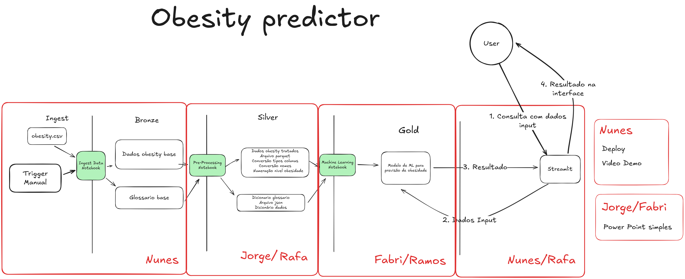
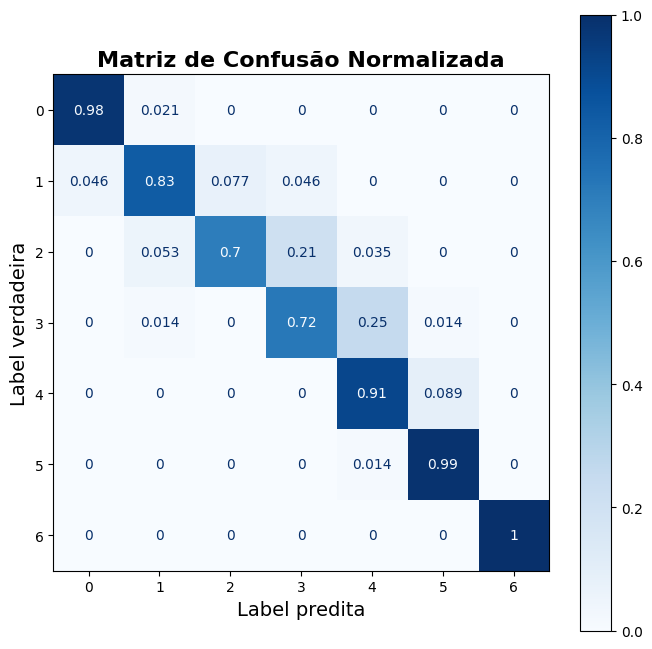
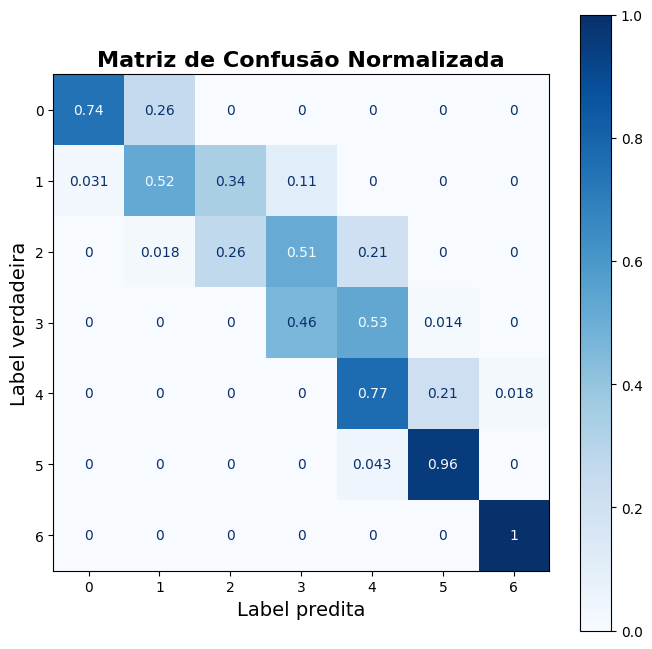
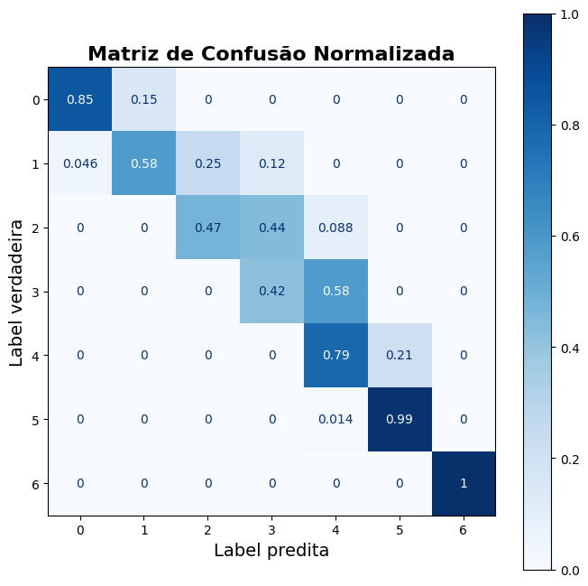
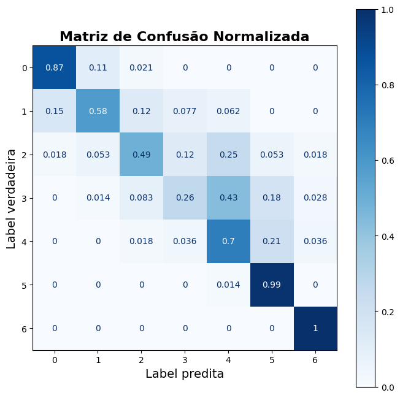
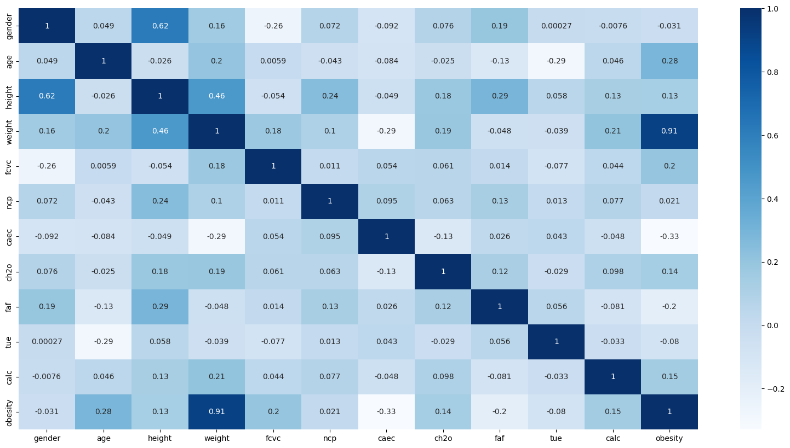

# Challenge 4 - Previsão Obesidade



## URL Projeto

- [Obesity Predictor - Produção](https://postech-4-obesity-detection.streamlit.app/)

## Visão Geral do Projeto

Este projeto tem como objetivo desenvolver um sistema preditivo para auxiliar médicos e médicas na previsão de obesidade em pacientes. A obesidade é uma condição médica caracterizada pelo acúmulo excessivo de gordura corporal, que pode prejudicar a saúde. O sistema utiliza um modelo de Machine Learning treinado com dados de pacientes para prever o nível de obesidade e fornecer insights personalizados para a equipe médica.

## Resultados do Modelo

O modelo Random Forest desenvolvido apresenta excelente performance na predição de obesidade:

**Acurácia: 87.0%** | **Precisão: 88.0%** | **Recall: 87.0%** | **F1-Score: 87.0%**

### Relatório de Classificação Detalhado

| Classe | Precisão | Recall | F1-Score | Suporte |
|--------|----------|--------|----------|---------|
| 0 | 0.94 | 0.98 | 0.96 | 47 |
| 1 | 0.92 | 0.83 | 0.87 | 65 |
| 2 | 0.89 | 0.70 | 0.78 | 57 |
| 3 | 0.78 | 0.72 | 0.75 | 72 |
| 4 | 0.71 | 0.91 | 0.80 | 56 |
| 5 | 0.92 | 0.99 | 0.95 | 69 |
| 6 | 1.00 | 1.00 | 1.00 | 57 |

**Métricas Gerais:**

- **Macro Average:** Precisão: 0.88 | Recall: 0.88 | F1-Score: 0.87
- **Weighted Average:** Precisão: 0.88 | Recall: 0.87 | F1-Score: 0.87
- **Total de Amostras:** 423

### Métricas de Performance



### Comparação de Modelos

#### Decision Tree



#### Gradient Boosting



#### Logistic Regression



### Análise Exploratória - Correlação Variáveis



### Estrutura do Projeto

O projeto está organizado da seguinte forma:

```
projeto-obesidade/
├── code/                           # Código fonte do projeto
│   ├── notebooks/                  # Jupyter notebooks para análise e processamento
│   │   ├── bronze/                 # Camada de ingestão de dados brutos
│   │   │   └── ingest_data.ipynb   # Notebook para carregamento inicial dos dados
│   │   ├── silver/                 # Camada de processamento e limpeza
│   │   │   └── process_obesity.ipynb # Transformação e tradução dos dados
│   │   └── gold/                   # Camada de modelagem
│   │       └── generate_model.ipynb # Treinamento do modelo Random Forest
│   └── streamlit/                  # Aplicativo web preditivo
│       ├── app.py                  # Interface principal do Streamlit
│       ├── utils.py                # Funções auxiliares e transformações
│       └── requirements.txt        # Dependências específicas do Streamlit
├── data/                           # Dados em diferentes estágios de processamento
│   ├── ingest/                     # Área de staging para novos dados
│   ├── bronze/                     # Dados brutos originais
│   │   └── Obesity.csv             # Dataset original de obesidade
│   ├── silver/                     # Dados processados e traduzidos
│   │   ├── header_obesity.json     # Dicionário de tradução de colunas
│   │   ├── value_obesity.json      # Mapeamento de valores categóricos
│   │   ├── frequency_obesity.json  # Codificação de frequências
│   │   ├── obesity_processed.parquet # Dados processados (formato otimizado)
│   │   └── obesity_processed.xlsx  # Dados processados (formato Excel)
│   └── gold/                       # Modelo treinado e artifacts
│       └── model.joblib            # Modelo Random Forest serializado
├── docs/                           # Documentação e recursos visuais
│   └── image.png                   # Imagem ilustrativa do projeto
├── Dockerfile                      # Configuração do container Docker
├── docker-compose.yml              # Orquestração de serviços
├── pyproject.toml                  # Configuração do projeto Python
└── README.md                       # Documentação principal
```

### Funcionalidades

1. **Pipeline de Machine Learning**:
    - Processamento de dados em camadas (bronze → silver → gold)
    - Feature engineering com transformações específicas para cada tipo de variável
    - Treinamento de modelo Random Forest com assertividade acima de 75%
    - Salvamento do modelo treinado em formato `.joblib`
    - Geração de dicionários de tradução e mapeamento em JSON

2. **Aplicativo Preditivo**:
    - Deploy do modelo em aplicativo Streamlit interativo
    - Interface amigável para entrada de dados do paciente
    - Previsão do nível de obesidade com 6 categorias: insufficient_weight, normal_weight, overweight_level_i/ii, obesity_type_i/ii/iii
    - Cálculo automático de IMC e recomendação de ingestão de água

3. **Painel Analítico e Insights**:
    - Geração de insights personalizados baseados nos dados inseridos
    - Visualizações interativas com Plotly (gauge de IMC com faixas coloridas)
    - Sistema de alertas e recomendações categorizados em "bom" e "atenção"
    - Análise de fatores de risco como histórico familiar, consumo calórico e atividade física

4. **Containerização**:
    - Deploy simplificado com Docker e docker-compose
    - Ambiente isolado e reproduzível
    - Configuração automática de dependências

### Processamento dos Dados

O processamento segue uma arquitetura de dados em camadas:

1. **Bronze (Ingestão)**:
    - Carregamento do arquivo `Obesity.csv` original
    - Validação básica de integridade dos dados
    - Função `ingest_obesity_file()` para automatizar o processo

2. **Silver (Processamento)**:
    - Limpeza e padronização dos dados
    - Tradução de campos para português usando dicionários específicos
    - Conversão de tipos de dados apropriados
    - Geração de arquivos JSON para mapeamentos:
       - `header_obesity.json`: Tradução de colunas
       - `value_obesity.json`: Mapeamento de valores
       - `frequency_obesity.json`: Codificação de frequências
    - Salvamento em formatos `.parquet` e `.xlsx`

3. **Gold (Modelo)**:
    - Feature engineering com transformações específicas
    - Aplicação de encoders ordinais e one-hot encoding
    - Normalização de variáveis contínuas (idade, peso, altura)
    - Preparação final para treinamento do modelo

### Variáveis do Dataset

O projeto trabalha com as seguintes variáveis traduzidas:
- **Gênero**: Masculino/Feminino
- **Idade**: Em anos
- **Altura**: Em metros
- **Peso**: Em quilogramas
- **Histórico familiar**: Excesso de peso na família
- **FAVC**: Consumo de alimentos altamente calóricos
- **FCVC**: Consumo de vegetais nas refeições
- **NCP**: Número de refeições principais diárias
- **CAEC**: Consumo entre refeições
- **SMOKE**: Tabagismo
- **CH2O**: Consumo diário de água
- **SCC**: Monitoramento de calorias
- **FAF**: Frequência de atividade física
- **TUE**: Tempo de uso de dispositivos tecnológicos
- **CALC**: Consumo de álcool
- **MTRANS**: Meio de transporte utilizado

### Como Executar o Projeto

1. **Pré-requisitos**:
    - Docker e Docker Compose instalados
    - Python 3.12+ (conforme pyproject.toml)

2. **Passos**:
    - Clone o repositório: `git clone <repo_url>`
    - Navegue até o diretório do projeto: `cd <project_directory>`
    - Construa e inicie os containers: `docker-compose up --build`
    - Acesse o aplicativo no navegador: `http://localhost:8501`

3. **Execução Local** (alternativa):
    - Instale dependências: `uv sync` (ou `uv pip install -r code/streamlit/requirements.txt`)
    - Execute: `uv run streamlit run code/streamlit/app.py`

### Exemplos de Uso

- **Previsão de Obesidade**:
    - Insira dados como idade (anos), peso (kg), altura (m), histórico familiar
    - Configure frequências de consumo alimentar e atividade física
    - Receba predição do nível de obesidade com confiança do modelo

- **Insights Personalizados**:
    - IMC calculado automaticamente com indicador visual colorido
    - Recomendação personalizada de ingestão de água (0.033L × peso corporal)
    - Alertas baseados em fatores de risco identificados

### Detalhes Técnicos

- **Transformações de Dados**:
    - Classes customizadas para pipeline: `OneHotEncodingNames`, `OrdinalFeature`, `MinMax`
    - Dicionários de mapeamento para padronização: `DICT_YES_NO_TO_BOOL`, `DICT_LEVEL_OBESITY`, `DICT_FREQUENCY_OBESITY`
    - Codificação ordinal para variáveis categóricas ordenadas

- **Modelo de Machine Learning**:
    - Random Forest como algoritmo principal
    - Modelo salvo como `model.joblib` para carregamento rápido
    - Predição em tempo real no Streamlit

- **Interface e Visualizações**:
    - Gauge interativo para IMC com faixas de classificação (normal, sobrepeso, obesidade)
    - Sistema de alertas categorizados (positivos em verde, atenção em amarelo/vermelho)
    - Expandable sections para informações detalhadas

- **Gerenciamento de Dependências**:
    - `pyproject.toml` para configuração principal do projeto
    - `requirements.txt` específico para ambiente Streamlit
    - Separação clara entre dependências de desenvolvimento e produção

## Referencias

* [Kaggle Dataset - Obesity](https://www.kaggle.com/datasets/fatemehmehrparvar/obesity-levels)
* [Article Exploring Dataset](https://www.mdpi.com/2076-3417/13/6/3875)
* [Original Article with research](https://www.sciencedirect.com/science/article/pii/S2352340919306985#cebib0010)