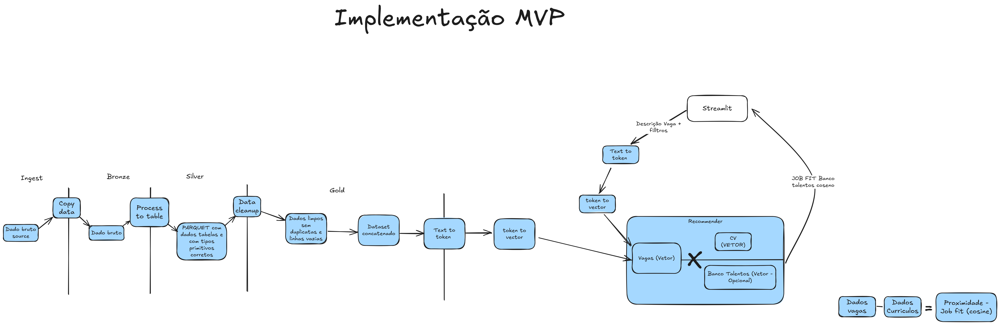
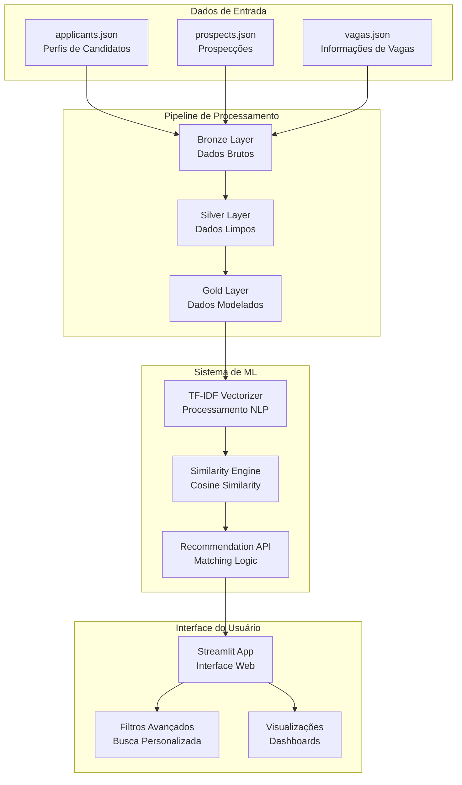
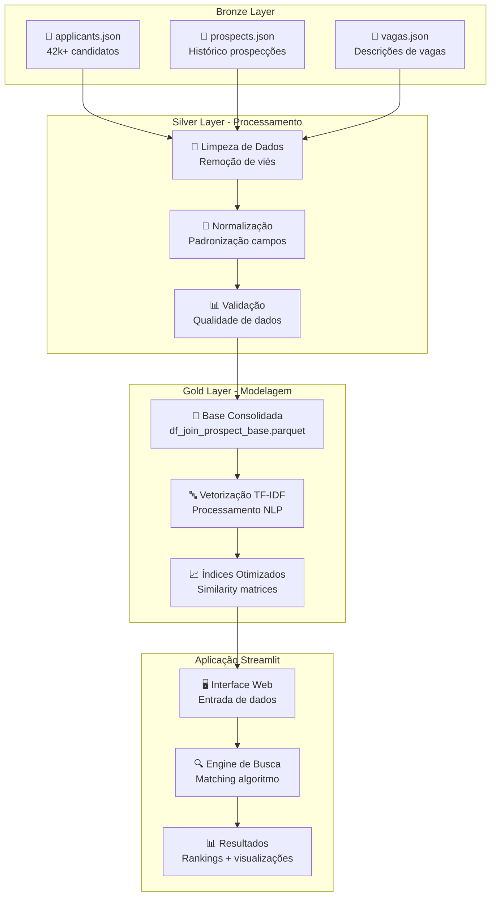
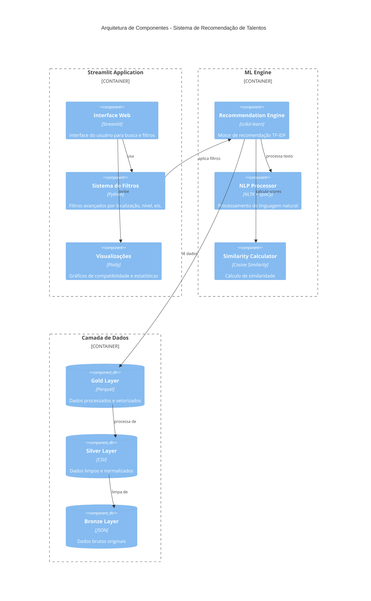
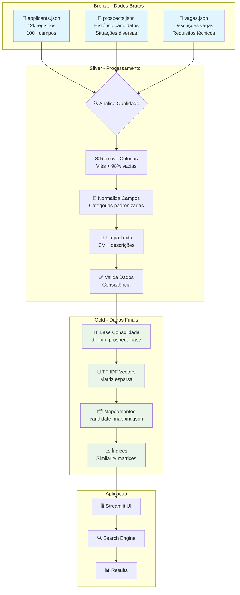
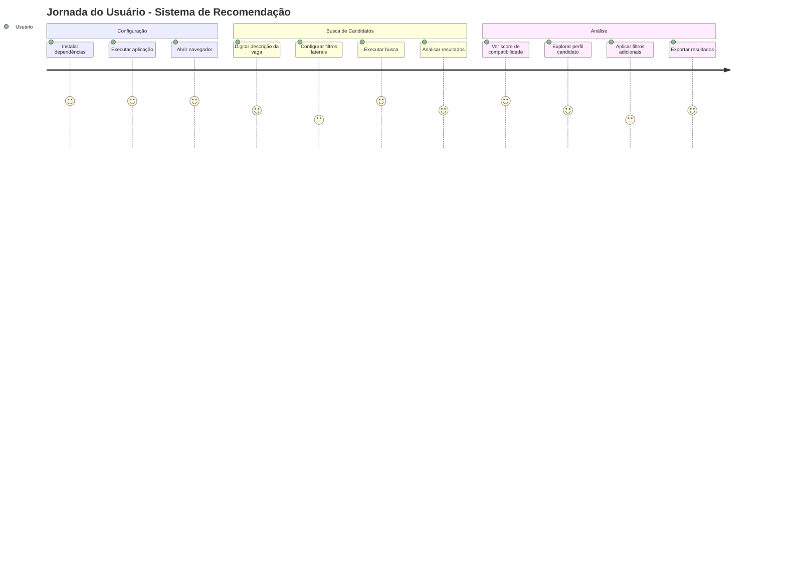
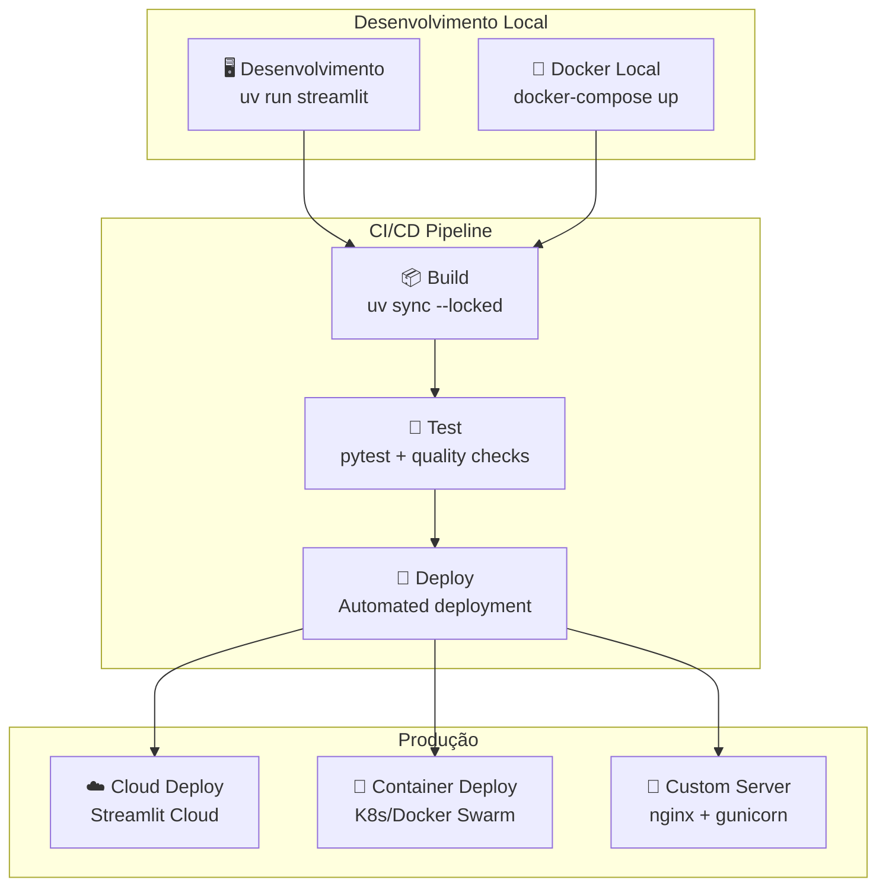

# Challenge 5 - Sistema de Recomendação de Talentos



## 📋 Visão Geral

Este projeto desenvolve um **Sistema Inteligente de Recomendação de Talentos** utilizando técnicas avançadas de Machine Learning e Processamento de Linguagem Natural (NLP). O sistema analisa descrições de vagas e perfis de candidatos para realizar correspondências precisas, auxiliando empresas na seleção de talentos.

## 🎯 Objetivos

- Automatizar o processo de triagem de candidatos
- Reduzir viés na seleção através de análise baseada em dados
- Melhorar a precisão do matching entre vagas e candidatos
- Disponibilizar interface intuitiva para análise de talentos

## 🏗️ Arquitetura do Projeto

### Visão Geral da Arquitetura



### Fluxo de Dados Detalhado



### Estrutura de Dados (Camadas Bronze, Silver, Gold)

```
data/
├── bronze/          # Dados brutos originais
│   ├── applicants.json    # Perfis de candidatos
│   ├── prospects.json     # Prospecções de vagas
│   └── vagas.json        # Informações das vagas
├── silver/          # Dados processados e limpos
│   ├── application.csv    # Candidatos processados
│   └── outros arquivos de processamento
└── gold/            # Dados prontos para análise/modelo
    ├── df_join_prospect_base.parquet    # Base consolidada
    ├── talent_pool_sample.parquet       # Amostra de talentos
    ├── candidate_mapping.json           # Mapeamentos padronizados
    └── arquivos de vetorização TF-IDF
```

### Notebooks de Processamento

```
code/notebook/
├── bronze/     # Exploração e limpeza inicial dos dados
├── silver/     # Transformações e normalização
└── gold/       # Modelagem e vetorização final
```

### Aplicação Streamlit

```
code/streamlit/
├── app.py                    # Aplicação principal
├── candidate_mapping.json   # Glossário de padronização
├── talent_pool_sample.parquet  # Base de candidatos
└── utils.py                 # Funções auxiliares
```

## 🔧 Configuração do Ambiente

### Pré-requisitos

- Python 3.12+
- UV (gerenciador de pacotes Python)
- Docker (opcional)

### Instalação com UV

```bash
# Instalar dependências
uv sync --locked

# Executar aplicação
uv run streamlit run code/streamlit/app.py
```

### Instalação com Docker

```bash
# Construir e executar
docker-compose up --build

# Acessar em http://localhost:8000
```

### Dependências Principais

```toml
dependencies = [
    "streamlit>=1.47.1",      # Interface web
    "pandas>=2.3.1",          # Manipulação de dados
    "scikit-learn>=1.7.1",    # Machine Learning
    "spacy>=3.8.7",          # Processamento de linguagem
    "nltk>=3.9.1",           # Toolkit de linguagem natural
    "plotly>=6.2.0",         # Visualizações interativas
    "numpy>=2.3.2",          # Computação numérica
]
```

## 📊 Processo de Tratamento de Dados

### Dados de Candidatos (Application)

#### Colunas Removidas (Redução de Viés)
- **Informações pessoais**: nome, email, telefone, CPF
- **Dados demográficos**: data_nascimento (viés por idade)
- **Colunas vazias**: email_secundario, cv_en, qualificacoes (98% vazias)
- **Informações irrelevantes**: inserido_por, download_cv

#### Normalizações Aplicadas
- **Níveis acadêmicos**: Padronização de categorias educacionais
- **Níveis de idiomas**: Inglês e espanhol em escala padrão
- **Conhecimentos técnicos**: Separação por delimitadores (`;`, `,`, `|`)
- **Remuneração**: Normalização de formatos diversos
- **CV em português**: Limpeza e padronização de texto

### Dados de Vagas

#### Colunas Removidas
- **Informações de clientes**: solicitante_cliente, empresa_divisao
- **Dados pessoais**: requisitante, analista_responsavel
- **Campos vazios**: nome (99%), telefone (99%), horario_trabalho (99%)
- **Viés demográfico**: faixa_etaria

#### Padronizações
- **Localização**: Estado e cidade normalizados
- **Níveis profissionais**: 14 categorias padronizadas
- **Áreas de atuação**: 73 áreas organizadas
- **Tipo de contratação**: 39 opções consolidadas

### Dados de Prospecção (Prospects)

#### Tratamentos Especiais
- **Códigos de prospect**: Correção de formato numérico
- **Situação do candidato**: 21 categorias distintas padronizadas
- **Títulos profissionais**: Padronização de senioridade

## 🤖 Sistema de Recomendação

### Pipeline de Machine Learning

```mermaid
graph LR
    subgraph "Entrada de Dados"
        A[📝 Descrição da Vaga<br/>Texto livre]
        B[👤 Perfil do Candidato<br/>CV + metadados]
    end
    
    subgraph "Pré-processamento NLP"
        C[🧹 Limpeza de Texto<br/>Remove caracteres especiais]
        D[🔤 Tokenização<br/>NLTK + spaCy]
        E[⛔ Remove Stopwords<br/>Português BR]
        F[🌱 Stemming/Lemmatization<br/>RSLP Algorithm]
    end
    
    subgraph "Vetorização"
        G[🎯 TF-IDF Vectorizer<br/>10k+ vocabulário]
        H[📊 Matriz de Features<br/>Sparse matrix]
    end
    
    subgraph "Similaridade"
        I[📐 Cosine Similarity<br/>Cálculo de distância]
        J[🏆 Ranking<br/>Top N candidatos]
    end
    
    subgraph "Pós-processamento"
        K[🔍 Aplicar Filtros<br/>Local, nível, idiomas]
        L[📈 Score Final<br/>0-100% match]
    end
    
    A --> C
    B --> C
    C --> D
    D --> E
    E --> F
    F --> G
    G --> H
    H --> I
    I --> J
    J --> K
    K --> L
```



### Arquitetura de Componentes



### Tecnologias Utilizadas

- **TF-IDF Vectorization**: Análise de texto em português
- **Cosine Similarity**: Cálculo de similaridade entre perfis
- **spaCy**: Processamento de linguagem natural
- **NLTK**: Tokenização e remoção de stopwords

### Funcionalidades da Aplicação

#### 🔍 Busca por Descrição de Vaga
- Entrada de texto livre com descrição da vaga
- Análise automática de requisitos
- Ranking de candidatos por compatibilidade
- Filtros avançados por localização, nível acadêmico, idiomas

#### 📋 Filtros Disponíveis
- **Localização**: 27 estados brasileiros
- **Nível Acadêmico**: Desde ensino fundamental até doutorado
- **Idiomas**: Inglês e espanhol (níveis básico a fluente)
- **Nível Profissional**: Estagiário a gerente
- **Vagas Afirmativas**: Filtros para mulheres e PcD

#### 📊 Visualizações
- Gauge charts de compatibilidade
- Resumo de perfis de candidatos
- Estatísticas de filtros aplicados

## 🔄 Pipeline de Dados

### Transformação de Dados Detalhada



### Bronze → Silver → Gold

1. **Bronze**: Dados brutos em JSON
2. **Silver**: Limpeza, normalização e validação
3. **Gold**: Vetorização TF-IDF e índices otimizados

### Glossário de Padronização

```json
{
  "senioridade_group": {
    "Trainee": "Estagiário",
    "Júnior": "Analista Júnior",
    "Pleno": "Analista Pleno"
  },
  "idioma_nvl": {
    "Básico": 1,
    "Intermediário": 3,
    "Avançado": 4,
    "Fluente": 5
  }
}
```

## 📈 Métricas do Sistema

- **Base de dados**: 42.000+ perfis de candidatos
- **Vocabulário**: 10.000+ termos únicos
- **Tempo de resposta**: < 1 segundo para consultas
- **Uso de memória**: ~50MB para matriz TF-IDF

## 🚀 Como Usar

### Fluxo do Usuário



### Opções de Deployment



### 1. Executar Localmente

```bash
# Com UV
uv run streamlit run code/streamlit/app.py

# Com pip
pip install -r requirements.txt
streamlit run code/streamlit/app.py
```

### 2. Acessar Interface

Abra o navegador em `http://localhost:8501`

### 3. Funcionalidades

1. **Digite descrição da vaga** no campo de texto
2. **Configure filtros** na barra lateral
3. **Analise resultados** com scores de compatibilidade
4. **Explore perfis** de candidatos recomendados

## 📝 Considerações Técnicas

### Redução de Viés

- Remoção de dados demográficos sensíveis
- Foco em competências técnicas e experiência
- Padronização de critérios de avaliação
- Filtros específicos para vagas afirmativas

### Escalabilidade

- Processamento em lotes para grandes volumes
- Cache de vetorização para performance
- Arquitetura modular para manutenção

### Qualidade dos Dados

- Validação automática de campos obrigatórios
- Normalização consistente de texto
- Tratamento de valores ausentes
- Auditoria de qualidade por camada


Este projeto faz parte do Challenge 5 da especialização em Data Analytics da Postech - FIAP.

---

Desenvolvido com ❤️ usando Streamlit, scikit-learn e técnicas avançadas de NLP